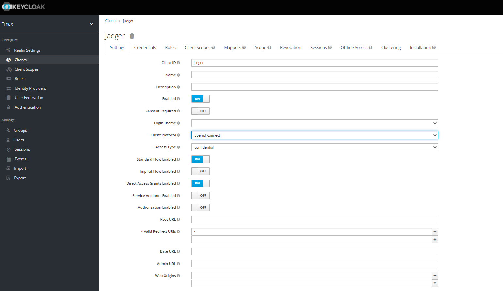

# Istio 설치 가이드

## 개요

- Istio는 MSA 구축을 위해 마이크로 서비스 간 데이터 공유를 제어하는 Service Mesh 솔루션이다.
- Service Discovery, Load Balancing, Canary Rollout, Circuit Breaking 등 트래픽을 관리, Service간에 mTLS 제공 및 Jaeger와 Kiali로 tracing과 Monitoring한다.

## 구성 요소 및 버전

* istiod ([docker.io/istio/pilot:1.15.4](https://hub.docker.com/layers/istio/pilot/1.15.4/images/sha256-0416a54dcbd44ca676487a514457e74837774ca2a01a65dc77dca8dbcd2bab6c?context=explore))
* istio-ingressgateway, sidecar ([docker.io/istio/proxyv2:1.15.4](https://hub.docker.com/layers/istio/proxyv2/1.15.4/images/sha256-978f9a028f210d35683b5c1c800798f05aeee3430cce0ef49d71d533aededafd?context=explore))
* jaeger-agent[(docker.io/jaegertracing/jaeger-agent:1.35)](https://hub.docker.com/layers/jaegertracing/jaeger-agent/1.35/images/sha256-c835e623c16286289963c98362a331c6f79790f6eff032f286652fed5b6b26f9?context=explore)
* jaeger-query[(docker.io/jaegertracing/jaeger-query:1.35)](https://hub.docker.com/layers/jaegertracing/jaeger-query/1.35/images/sha256-52e4f036045650a08b93e8f22e73fad2ecce558bc8675199e5917c0f87beee97?context=explore)
    * gatekeeper([docker.io/tmaxcloudck/gatekeeper:v1.0.2](https://hub.docker.com/layers/gatekeeper/tmaxcloudck/gatekeeper/v1.0.2/images/sha256-a9152f8e4ef0de9a27ce8471a6f7d46f86d42ae238cbd7e568ea7b480dbd200a?context=explore))
* jaeger-loki-plugin (for grpc-plugin) ([docker.io/tmaxcloudck/jaeger-loki-plugin:v2.0.2](https://hub.docker.com/layers/tmaxcloudck/jaeger-loki-plugin/v2.0.2/images/sha256-fa9d2d566af611650ef305b678d15ad8bc37f5075c7d6644c517f1a0f8729da7?context=explore))
* jaeger-collector([docker.io/jaegertracing/jaeger-collector:1.35](https://hub.docker.com/layers/jaegertracing/jaeger-collector/1.35/images/sha256-c19c2b6d30f37b8fd9b934575cabe73ad98bd1233f79a6438412605983ed899b?context=explore))
* bookinfo example
    * productpage([docker.io/istio/examples-bookinfo-productpage-v1:1.15.0](https://hub.docker.com/layers/istio/examples-bookinfo-productpage-v1/1.15.0/images/sha256-0a5eb4795952372251d51f72834bccb7ea01a67cb72fd9b58b757cca103b7524?context=explore))
    * details([docker.io/istio/examples-bookinfo-details-v1:1.15.0](https://hub.docker.com/layers/istio/examples-bookinfo-details-v1/1.15.0/images/sha256-fce0bcbff0bed09116dacffca15695cd345e0c3788c15b0114a05f654ddecc17?context=explore))
    * ratings([docker.io/istio/examples-bookinfo-ratings-v1:1.15.0](https://hub.docker.com/layers/istio/examples-bookinfo-ratings-v1/1.15.0/images/sha256-09b9d6958a13ad1a97377b7d5c2aa9e0372c008cdf5a44ce3e72fbd9660936cf?context=explore))
    * reviews-v1([docker.io/istio/examples-bookinfo-reviews-v1:1.15.0](https://hub.docker.com/layers/istio/examples-bookinfo-reviews-v1/1.15.0/images/sha256-40e8aba77c1b46f37e820a60aa6948485d39e6f55f1492fa1f17383efd95511c?context=explore))
    * reviews-v2([docker.io/istio/examples-bookinfo-reviews-v2:1.15.0](https://hub.docker.com/layers/istio/examples-bookinfo-reviews-v2/1.15.0/images/sha256-e86d247b7ac275eb681a7e9c869325762686ccf0b5cfb6bde100ff2c1f01ae2b?context=explore))
    * reviews-v3([docker.io/istio/examples-bookinfo-reviews-v3:1.15.0](https://hub.docker.com/layers/istio/examples-bookinfo-reviews-v3/1.15.0/images/sha256-e454cab754cf9234e8b41d7c5e30f53a4c125d7d9443cb3ef2b2eb1c4bd1ec14?context=explore))

## Prerequisites

- loki (grpc-plugin) / EFK (elasticsearch) / Opensearch Stack (Opensearch)
  <br/> install-istio 5.2부터는 jaeger의 log aggregation system으로 loki를 사용하는 것을 권장함.
- HyperAuth 

## 폐쇄망 설치 가이드
설치를 진행하기 전 아래의 과정을 통해 필요한 이미지 및 yaml 파일을 준비한다.
1. **폐쇄망에서 설치하는 경우** 사용하는 image repository에 istio 설치 시 필요한 이미지를 push한다.
   
    - [install-registry 이미지 푸시하기 참조](https://github.com/tmax-cloud/install-registry/blob/5.0/podman.md)  
    
2. install yaml을 다운로드한다.
   
    ```bash
    $ wget https://raw.githubusercontent.com/tmax-cloud/install-istio/5.2/yaml/1.istio-base.yaml
    $ wget https://raw.githubusercontent.com/tmax-cloud/install-istio/5.2/yaml/2-1.istio-tracing-es.yaml
    $ wget https://raw.githubusercontent.com/tmax-cloud/install-istio/5.2/yaml/2-2.istio-tracing-os.yaml
    $ wget https://raw.githubusercontent.com/tmax-cloud/install-istio/5.2/yaml/3.istio-core.yaml
    $ wget https://raw.githubusercontent.com/tmax-cloud/install-istio/5.2/yaml/4.istio-ingressgateway.yaml
    $ wget https://raw.githubusercontent.com/tmax-cloud/install-istio/5.2/yaml/5.istio-metric.yaml
    $ wget https://raw.githubusercontent.com/tmax-cloud/install-istio/5.2/yaml/bookinfo.yaml
    ```

## Install Steps

---

## Step0. 폐쇄망 설정

  * 폐쇄망에서 설치를 진행하여 별도의 image registry를 사용하는 경우 registry 정보를 추가로 설정해준다. 

      * grpc-plugin

          ```bash
          $ sed -i 's/docker.io\/jaegertracing\/jaeger-agent/'${REGISTRY}'\/jaegertracing\/jager-agent/g' 2.istio-tracing-loki.yaml
          $ sed -i 's/docker.io\/jaegertracing\/jager-query/'${REGISTRY}'\/jaegertracing\/jaeger-query/g' 2.istio-tracing-loki.yaml
          $ sed -i 's/docker.io\/jaegertracing\/jaeger-collector/'${REGISTRY}'\/jaegertracing\/jaeger-collector/g' 2.istio-tracing-loki.yaml
          ```

      * elasticsearch
    
        ```bash
        $ sed -i 's/docker.io\/jaegertracing\/jaeger-agent/'${REGISTRY}'\/jaegertracing\/jager-agent/g' 2-1.istio-tracing-es.yaml
        $ sed -i 's/docker.io\/jaegertracing\/jager-query/'${REGISTRY}'\/jaegertracing\/jaeger-query/g' 2-1.istio-tracing-es.yaml
        $ sed -i 's/docker.io\/jaegertracing\/jaeger-collector/'${REGISTRY}'\/jaegertracing\/jaeger-collector/g' 2-1.istio-tracing-es.yaml
        ```
    
    * opensearch
    
        ```bash
        $ sed -i 's/docker.io\/jaegertracing\/jaeger-agent/'${REGISTRY}'\/jaegertracing\/jager-agent/g' 2-2.istio-tracing-os.yaml
        $ sed -i 's/docker.io\/jaegertracing\/jager-query/'${REGISTRY}'\/jaegertracing\/jaeger-query/g' 2-2.istio-tracing-os.yaml
        $ sed -i 's/docker.io\/jaegertracing\/jaeger-collector/'${REGISTRY}'\/jaegertracing\/jaeger-collector/g' 2-2.istio-tracing-os.yaml
        ```
    

```bash
$ sed -i 's/docker.io\/istio/'${REGISTRY}'\/istio/g' 3.istio-core.yaml
$ sed -i 's/docker.io\/istio\/proxyv2/'${REGISTRY}'\/istio\/proxyv2/g' 4.istio-ingressgateway.yaml
$ sed -i 's/docker.io/'${REGISTRY}'/g' bookinfo.yaml
```

---

## Step 1. hyperauth API-GATEWAY 연동

[가이드 링크](https://github.com/tmax-cloud/hyperauth/blob/main/guide/keycloak-gatekeeper/keycloak-gatekeeper.pptx)

1. 클라이언트 생성
  - Client-Protocol : openid-connect
  - Access Type : confidential



2. 클라이언트 role (manager) 생성

- role를 가진 사용자만 client에 등록된 서비스에 로그인할 수 있다


3. 관리자계정에 manager role 등록
   - 관리자 계정(admin) - role mappings - client roles: jaeger 선택


4. 클라이언트- mapper 생성
   - Access Token Audience에 포함시키기 위함


---

## Step 1. 버전 수정

* 목적 : `설치 위한 정보 기입`
* 순서 : 알맞은 config 내용 작성 [(version.conf)](./version.conf)
  - CLIENT_ID,CLIENT_SECRET,CLIENT_ROLE은 hyperauth에서 생성한 값을 이용한다
  - [jaeger-gatekeeper-forbidden-cm.yaml](yaml/jaeger-gatekeeper-forbidden-cm.yaml)은 로그인 실패시 나타는 화면이다.
    - html 마지막 logout A 태그 redirect 주소를 실제 노출 주소로 변경 해주어야한다

---

## Step 2. installer 실행
* 목적 : `설치 위한 쉘 스크립트 실행`
* 순서 : 권한 부여 및 스크립트 실행

```bash
$ sudo chmod +x install.sh
$ ./install.sh
```


### Uninstaller 가이드

- 목적: `삭제를 위한 쉘 스크립트 실행`
- 순서: 권한 부여 및 스크립트 실행

```bash
$ sudo chmod +x uninstall.sh
$ ./uninstall.sh
```

---


## Step 3. bookinfo 예제

* 목적 : `istio 설치 검증을 위한 bookinfo 예제`
* 생성 순서 : [bookinfo.yaml](yaml/bookinfo.yaml) 실행
* 비고 :
    * bookinfo 예제 배포
        * application에 접속하기 위해 [service productpage의 타입](yaml/bookinfo.yaml#L278)을 NodePort/LoadBalancer로 변경한다.
        * bookinfo 예제를 배포할 namespace에 istio-injected=enabled label을 추가한 뒤, bookinfo 예제를 배포한다.
        ```bash
        $ kubectl label namespace $YOUR_NAMESPACE istio-injection=enabled
        $ kubectl apply -f bookinfo.yaml -n $YOUR_NAMESPACE
        ```
        * 이후 bookinfo-gateway.yaml에서 istio-ingressgateway의 이름에 맞게 selector/istio를 설정한 후 bookinfo-gateway와 bookinfo virtualservice를 배포한다.
        ```bash
        $ kubectl apply -f bookinfo-gateway.yaml -n $YOUR_NAMESPACE
        $ kubectl apply -f bookinfo-virtualservice.yaml -n $YOUR_NAMESPACE
        ```
        * curl로 bookinfo 예제를 istio-ingress를 통해 호출하여 요청이 잘 이루어지는지 확인한다.
        ```bash
        $ kubectl get svc -n istio-system
        $ curl -H "Host: bookinfo.demo.test" http://YOUR_ISTIO_INGRESSGATEWAY_ADDR/productpage
        ```
        * jaeger-query의 service를 외부로 노출한 후 해당 주소로 접근하여 해당 trace_data를 jaeger로 볼 수 있는 지 확인한다.
          (istio와 jaeger의 설정에 따라 여러 번 호출해야 sampling 될 수 있다.)

## 인증서 갱신 가이드

1. 인증서 갱신을 위한 스크립트 파일을 다운로드 하고 권한을 설정해준다.
    ```bash
    $ wget https://raw.githubusercontent.com/istio/tools/release-1.8/bin/root-transition.sh
    $ chmod +x root-transition.sh
    ```
2. 인증서 만료일을 확인한다.
    ```bash
    $ ./root-transition.sh check-root
    ```
3. 스크립트 파일을 이용하여 인증서를 갱신한다(10년 갱신).
    ```bash
    $ ./root-transition.sh root-transition
    ```


## Log level 설정 가이드

1. istio-tracing-xx.yaml
   - jaeger-agent
     - Daemonset의 args에 `--log-level=[debug/info/warn/error]` , default: info
   - jaeger-query
     - jaeger-query: Deployment의 args에 `--log-level=[debug/info/warn/error]`, default: info
     - gatekeeper: Deployment의 args에 `--log-level=[debug/info/warning/error/fatal/panic]` , default: info
   - jaeger-collector
     - Deployment의 args에 `--log-level=[debug/info/warn/error]` , default: info

2. istio-core.yaml
   - istiod
     - Deployment의 args에 `--log-output-level=[none/error/warn/info/debug]` 로 설정, default: info
   
3. istio-core.yaml
   - ingressgateway 및 sidecar
     - istio-sidecar-injector configMap의 values에 logging/level: `[trace|debug|info|warning|error|critical|off]`로 설정, default:info
     - 이를 통해 istio-injection=enabled인 pod에 들어가는 sidecar에 대해서도 logging level이 설정된다.

4. bookinfo.yaml (Workload)

   - istio-proxy Container

     - istio-sidecar-injector Configmap에 `proxy.loglevel= [info/warning/error/debug]`로 설정, default: warning

     - Configmap 수정 시, 기동중인 Pod 재기동 필요
     
       


    


